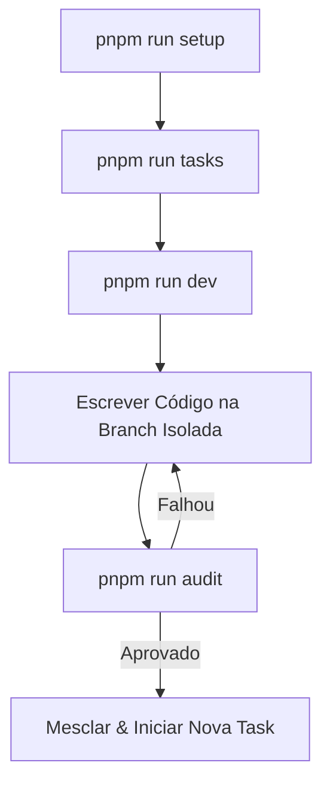

# 🚀 Antigravity Vibe Coding Harness

Bem-vindo ao **Antigravity Vibe Coding Harness**! Este é um template e infraestrutura de automação para acelerar o desenvolvimento de projetos utilizando agentes de inteligência artificial de forma estruturada, previsível e controlada.

A filosofia deste harness é baseada na **autonomia assistida**: a IA tem o poder de propor a lista de tarefas, rodar em branches isoladas para implementar recursos específicos, e passar por uma auditoria estrita de qualidade antes de mesclar o código.

---

## 🛠️ Arquitetura do Harness

O projeto está dividido em duas partes principais:
1. **`ai-docs/`**: A fonte de verdade do projeto. Contém o PRD (Requisitos), as diretrizes de design, a lista de tarefas gerada e as lições aprendidas ao longo do caminho.
2. **`harness/`**: O motor de automação (em TypeScript) responsável por orquestrar a geração de tarefas, controle de execução, isolamento de escopo via Git e auditoria de qualidade.

```
├── .antigravity/         # Configurações do Antigravity
├── ai-docs/              # Documentação de Inteligência Artificial
│   ├── todos/            # Gerenciamento de tarefas (Master e Atuais)
│   │   ├── task-master.json  # Controle programático do fluxo (Robusto!)
│   │   └── task-master.md   # Visualização legível para humanos
│   ├── DESIGN.md         # Regras Visuais e de Design (UI/UX)
│   ├── PRD.md            # Requisitos de Produto
│   └── tools.yaml        # Catálogo de Ferramentas/MCPs disponíveis
├── harness/              # Motor em TypeScript da Harness
│   ├── src/
│   │   ├── setup-project.ts # Script interativo de configuração
│   │   ├── create-tasks.ts  # Geração inteligente de tarefas estruturadas
│   │   ├── dev-runner.ts    # Orquestração de branches e início de tarefas
│   │   └── auditor.ts       # Validação automatizada de design e código
└── package.json          # Orquestrador monorepo do pnpm
```

---

## 🚀 Fluxo de Trabalho (Workflow)



### 1. ⚙️ Setup do Projeto
Ao iniciar um novo projeto a partir deste template, execute:
```bash
pnpm run setup
```
Este assistente interativo guiará você na configuração do nome do projeto, escopo do PRD, instalação de dependências e criação do arquivo `.env` de forma amigável.

### 2. 📝 Planejamento (Geração da Lista de Tarefas)
Após preencher o seu `PRD.md` e o `tools.yaml`, gere o roadmap de desenvolvimento do projeto rodando:
```bash
pnpm run tasks
```
Esse comando lerá o PRD, analisará a estrutura do diretório e usará o **Gemini 2.5 Pro** com estruturação estrita de dados (JSON Schema) para criar:
- `ai-docs/todos/task-master.json`: Usado programaticamente para garantir consistência e gerenciar dependências.
- `ai-docs/todos/task-master.md`: Visualização detalhada do roadmap do projeto.

### 3. 💻 Execução (Iniciar Trabalho na Task)
Para iniciar o trabalho na próxima tarefa elegível (que não tenha pendências ativas), execute:
```bash
pnpm run dev
```
O script irá:
1. Validar as dependências da tarefa no grafo.
2. Criar e alternar para uma branch Git isolada baseada na tarefa (ex: `task/001`).
3. Injetar um briefing de contexto detalhado em `ai-docs/todos/current-task-brief.md` com todas as lições aprendidas acumuladas.
4. Definir o status no master para `EM_ANDAMENTO`.

### 4. 🔎 Auditoria e Conclusão
Após concluir o código correspondente à tarefa na sua branch, execute a verificação executando:
```bash
pnpm run audit
```
O auditor extrairá o `git diff` e enviará juntamente com o `DESIGN.md` para o Gemini avaliar o seu código.
* **Falha:** Se o código violar diretrizes de UI ou qualidade, o auditor detalhará as falhas e travará o fluxo (impedindo commits ruins).
* **Sucesso:** Se aprovado, a tarefa será marcada como `CONCLUÍDO` no JSON e MD e você estará pronto para mesclar e ir para a próxima!

---

## 🔑 Requisitos

1. **PNPM** para gerenciamento de dependências.
2. Chave de API do Gemini configurada em seu `.env`:
   ```env
   GEMINI_API_KEY=sua_chave_aqui
   ```

Desenvolvido para máxima robustez e flexibilidade. Acelere seus projetos com a tranquilidade de um fluxo estruturado de engenharia de software! 🚀
